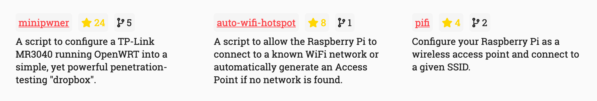

# React Github Repository [](https://travis-ci.org/nicholasadamou/react-github-repository) [](https://circleci.com/gh/nicholasadamou/react-github-repository)



A React component that fetches information on a given repository from GitHub using the GitHub API and returns the data in an elegant way.

## Development

### Requirements

- [Node.js](https://nodejs.org/en/)
- [Yarn](https://yarnpkg.com/en/) (recommended)

### Steps

Run the live-reload server on <http://localhost:3000>

```bash
make dev
```

### Modify `.env.example`

⚠️ Don't forget to modify the contents of `.env`! Take `.env.example` and fill out its contents and rename it to `.env`.

## 📚 The Tech. Stack

This project uses the following technologies:

**The Front-End**:

- [**React.js**](https://reactjs.org/) - For building the interface along with:
  - [**Styled-Components**](https://www.styled-components.com/) - for styling.
  - [**instant.page**](https://instant.page/) - Make your site's pages instant in 1 minute and improve your conversion rate by 1%.
  - [**github-api**](https://www.npmjs.com/package/github-api) - For making requests to the GitHub API within React.

**The Back-End**:

## ⛓️ CI/CD Pipeline

This project uses the following CI/CD Pipeline:

1. [**Travis CI**](https://travis-ci.org/nicholasadamou/nicholasadamou.com) - Travis is used to test whether or not this project builds successfully.
2. [**CircleCI**](https://circleci.com/) - Used for the same reason as Travis CI.

## License

© Nicholas Adamou.

It is free software, and may be redistributed under the terms specified in the [LICENSE] file.

[license]: LICENSE
